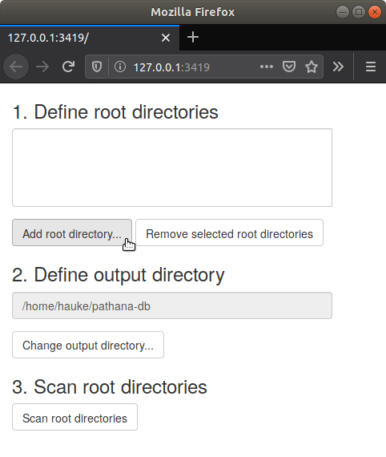
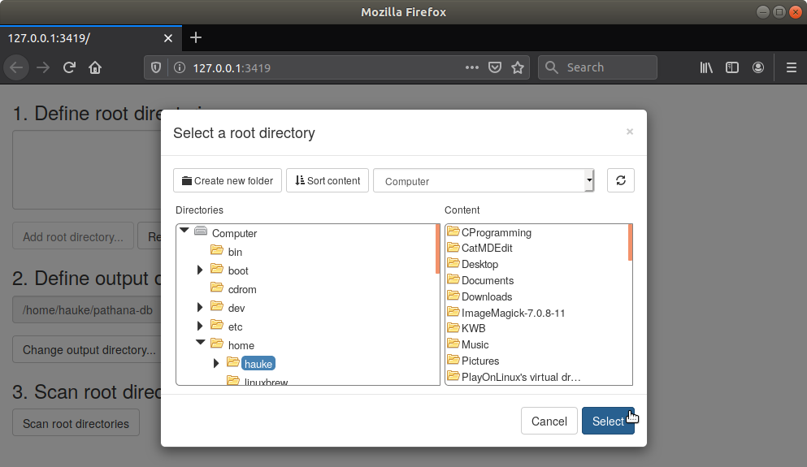
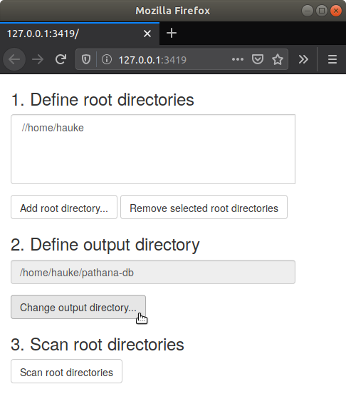
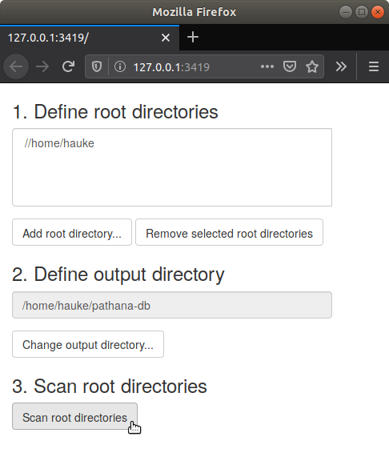
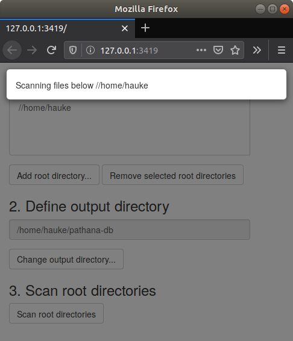
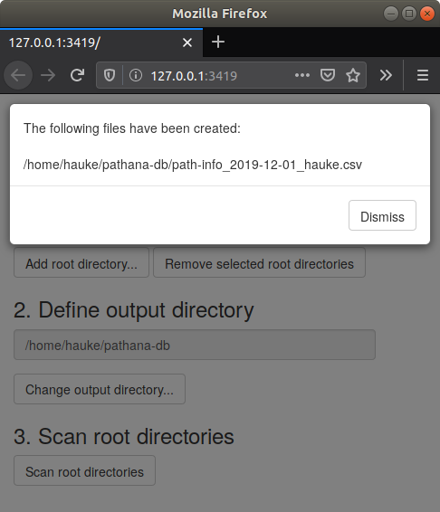

```{r, include = FALSE}
knitr::opts_chunk$set(
  collapse = TRUE,
  comment = "#>",
  eval = FALSE
)
```

Once you have installed the package fakin.path.app and all related packages, 
you are set up to 

1. [Scan your file system](#step-1) for file paths and file properties and save 
them to CSV files (CSV = Comma Separated Values),

2. [Run the Web Application](#step-2) to analyse the path information produced 
in the first step.

## Application 1: Scan your file system{#step-1}

Run the following R command to start the application that scans your system for
files to be analysed:

```{r}
fakin.path.app::run_app_scan()
```

This will open a new tab in your default web browser as shown here for a 
Mozilla Firefox browser on an Ubuntu Linux system:

{width=300px}

The main window is devided into three sections representing the steps required
to start the scan process:

1. Define root directories
2. Define ouput directory
3. Scan root directories

In the first step you define one or more root directories that act as the
starting point of the scan. The search is done recursively, i.e. files in all
folders and subfolders will be considered. Take this in mind when selecting a
root directory. It can take a long time to scan a "top-level" folder! Click the
Button "Add root directory..." to select a root directory:

{width=500px}

In the opening dialog window, use the left-hand pane to navigate to the folder
that you want to scan. Select the folder by clicking on its name (`hauke` in the
example). The contents of the folder are shown in the right-hand pane. Confirm
your selection by clicking the "Select" button. This closes the dialog window
and enters the path to the selected root directory (here: `/home/hauke`) in the
text field on top of the main window:

{width=300px}

In the next (optional) step you can set the output directory, i.e. the location
where to store the results of the scan. You may use the default
(`/home/hauke/pathana-db` in the example) or select another location by clicking
"Change output directory..." and selecting a different folder (similar to
selecting a root directory).

Once the root and output directories are specified, you are ready to start the 
scan process. Therefore, click the "Scan root directories" button...

{width=300px}

... and wait until the scan has been completed.

{width=300px}

The completion of the scan is indicated by a message box stating that the 
information on the scanned files have been written to a CSV file in the output
directory:

{width=300px}

Close the message box by clicking the "Dismiss" button. 

Now, that the result of the scan is available in a CSV file you are ready to run 
the application that helps you to inspect and analyse this file. Before you run 
this second application, close the current application by pressing ESC in the
R console or by closing the corresponding tab in the web browser.

## Application 2: Run the Web Application{#step-2}

```{r eval = FALSE}
# Set the path to your personal "path database" (a folder containing files as
# e.g. generated )

fakin.path.app::run_app()
```
